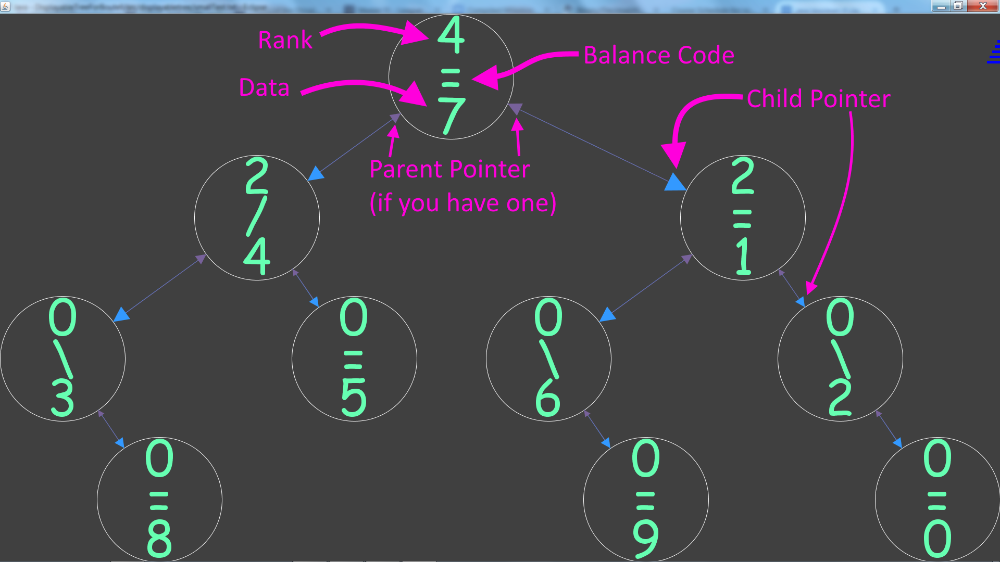

# EditorTrees

Originally Developed: (Course assignment starter code)  
Implementation Iterations: Milestones 1–3 (balancing, rank maintenance, deletion, substring retrieval)

Team: Xiaoxi Luo & Sam Cox

Note: This repository contains a custom editor-oriented balanced tree implementation with explicit rank tracking and rotation logic.

---

## Overview

EditorTrees is a Java project implementing a **height-balanced binary tree with ranks** (an AVL-style structure adapted for text editing operations).

This implementation demonstrates concrete tree algorithms and methods, including:

- Rank-based indexed insertion (`add(char ch, int pos)`)
- End insertion with balancing (`add(char ch)`)
- Single and double AVL rotations:
  - `singleRotateLeft`
  - `singleRotateRight`
  - `doubleRotateLeft`
  - `doubleRotateRight`
- Rank updates during rotations and structural edits
- Indexed character lookup (`get(int pos)`)
- Range retrieval in **O(length)** (`get(int pos, int length)`)
- Indexed deletion with successor replacement (`delete(int pos)`)
- Tree copy and string-to-tree construction:
  - `EditTree(EditTree e)`
  - `EditTree(String s)`
- Structural validation helpers:
  - `ranksMatchLeftSubtreeSize()`
  - `balanceCodesAreCorrect()`
- Performance/diagnostic helpers:
  - `fastHeight()`, `slowHeight()`, `slowSize()`
  - `totalRotationCount()`
  - `toRankString()`, `toDebugString()`

---

## Algorithms & Data Structure Techniques Demonstrated

### 1 AVL-Style Rebalancing with Balance Codes
Each node stores a balance code (`LEFT`, `SAME`, `RIGHT`) and rebalances after insertion/deletion using single or double rotations. This includes logic to detect LL/LR/RR/RL cases and apply the corresponding rotation sequence.

### 2 Rank-Augmented Nodes for Positional Editing
Every node tracks `rank` (its in-order index within its subtree), enabling efficient position-based operations:

- Insert at position
- Get character at index
- Delete at index
- Get substring by index range

### 3 Rotation-Aware Rank Maintenance
Rotation methods explicitly adjust rank values when subtrees move, preserving index correctness after structural modifications.

### 4 Efficient Substring Traversal
`get(pos, length)` is implemented to traverse only relevant branches/nodes contributing to the output range instead of materializing the full string first.

### 5 Verification-Oriented Development
The project includes correctness checks that compare stored structural metadata (rank/balance) against derived subtree properties, plus milestone-based JUnit tests to validate behavior incrementally.

---

## Tech Stack

- Java
- JUnit 4

---

## Project Structure

- `src/editortrees/EditTree.java` – top-level tree API and milestone methods
- `src/editortrees/Node.java` – core node algorithms (balancing, rotations, rank logic, recursive ops)
- `src/editortrees/EditTreeMilestone1Test.java` – foundational behavior tests
- `src/editortrees/EditTreeMilestone2Test.java` – balancing/rank-focused tests
- `src/editortrees/EditTreeMilestone3Test.java` – delete/range retrieval and advanced tests
- `src/editortrees/DisplayableBinaryTree.java` – optional visualization support
- `src/editortrees/DisplayableNodeWrapper.java` – node wrapper for graphical display
- `src/debughelp/README.txt` – setup guide for display/debug features
- `src/debughelp/displayableTreesInfoGraphic.png` – example tree visualization output
- `README.md` – current repository readme